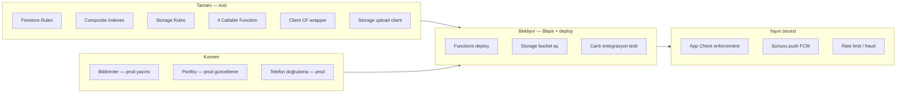

# BEX — Backend Tamamlama Yol Haritası

> **Proje:** `bexcursor`  
> **Stack:** Firestore · Firebase Auth · Storage · Cloud Functions (Node 20) · Expo push (FCM hazırlığı)  
> **Son güncelleme:** Haziran 2026

Bu doküman yalnızca **backend / Firebase altyapısı** içindir. UI fazları `YOL_HARITASI.md` ve uygulama içi `setup-guide` ekranında özetlenir.

---

## Özet: Neredeyiz?



| Alan | Kod | Canlı (prod) | Not |
|------|-----|--------------|-----|
| Firestore kuralları | ✅ | ✅ (deploy edildi) | `firestore.rules` |
| Firestore indeksler | ✅ | ✅ | `firestore.indexes.json` |
| Storage kuralları | ✅ | ⏳ | Bucket Console’da açılmalı |
| Callable Functions | ✅ | ⏳ | Blaze + `deploy:functions` |
| Takas swap | ✅ | ⏳ | `executeTradeSwap` |
| Demo geliştirme modu | ✅ | — | Auth emulator + `__DEV__` |
| Bildirim kaydı (Firestore) | ✅ CF | ⏳ deploy | Trigger + callable |
| Portföy güncelleme | ✅ CF | ⏳ deploy | `submission_approved` trigger |
| App Check | ⚠️ | ❌ | Client hazır, enforcement yok |
| FCM sunucu push | ❌ | ❌ | Token kaydı var, gönderim yok |
| Auth Custom Claims | ❌ | ❌ | Rol yalnızca Firestore `users` |

---

## Mevcut Cloud Functions (yazıldı, deploy bekliyor)

Dosya: `functions/src/index.ts`

| Function | Amaç | Client bağlantısı |
|----------|------|-------------------|
| `approveApplication` | pending → approved | ⚠️ Client doğrudan Firestore kullanıyor; CF opsiyonel |
| `issueCouponForSubmission` | submission_approved → rewarded + kupon | ✅ `cloudFunctions.issueCouponForSubmission` |
| `redeemCoupon` | İşletme QR/kupon kullanımı | ✅ `cloudFunctions.redeemCoupon` |
| `executeTradeSwap` | Takas kabul + kupon swap | ✅ `cloudFunctions.executeTradeSwap` |

**Kritik:** Firestore kuralları `coupons` için `create/update: false` — canlıda kupon ve takas **yalnızca Functions** ile çalışır.

---

## Faz B0 — Geliştirme (Blaze gerekmez) ✅

**Amaç:** Emulator + demo mod ile tüm akışları bitirmek.

```powershell
# Terminal 1
cd bex
npm run emulators

# Terminal 2
npm start
```

| Görev | Durum |
|-------|--------|
| Auth emulator (9099) | ✅ |
| Demo veri (`shouldUseDemoData`) | ✅ |
| Görev / başvuru / admin / takas test | ✅ |
| Storage emülatör (foto/KYC) | ⏳ Java + `npm run emulators:storage` |
| Functions emülatör (5001) | ⏳ Java + `npm run emulators:full` |

**Çıkış kriteri:** Tüm kullanıcı hikâyeleri demo modda sorunsuz.

---

## Faz B1 — Firebase Console hazırlığı ⏳

**Amaç:** Canlı backend’i açmak için hesap/plan.

| Adım | Kim | Komut / link |
|------|-----|--------------|
| Blaze plana geç | Sen | [Usage & billing](https://console.firebase.google.com/project/bexcursor/usage/details) |
| Bütçe alarmı (₺100/ay öneri) | Sen | [Google Cloud Billing](https://console.cloud.google.com/billing) |
| Storage bucket aç | Sen | Console → Storage → Get Started |
| (Opsiyonel) EAS projectId | Sen | `npx eas init` — push token için |

**Blaze olmadan devam edilebilir** — bu faz yalnızca canlı test / yayın öncesi gerekli.

---

## Faz B2 — Deploy çekirdeği ⏳

**Amaç:** Kurallar + Functions canlıya.

```powershell
cd bex

# Firestore (kurallar zaten güncelse tekrar)
npm run deploy:rules

# Storage kuralları (bucket açık olmalı)
npm run deploy:storage

# Cloud Functions (Blaze şart)
npm run deploy:functions
```

| Deploy | İçerik |
|--------|--------|
| `deploy:rules` | `firestore.rules` + `firestore.indexes.json` |
| `deploy:storage` | `storage.rules` |
| `deploy:functions` | 7 callable + 5 trigger function |

**Canlı test checklist (emulator kapalı, release/dev build):**

- [ ] Kullanıcı kayıt → `users` belgesi oluşuyor
- [ ] İşletme başvuru onayı → `approved`
- [ ] Teslim + admin onayı → `submission_approved`
- [ ] İşletme kupon ver → `issueCouponForSubmission` → cüzdanda kupon
- [ ] İşletme QR okut → `redeemCoupon`
- [ ] Takas teklif kabul → `executeTradeSwap` → iki yeni kupon, eskiler `traded`
- [ ] Teslim fotoğrafı yükle → Storage URL Firestore’da

**Çıkış kriteri:** Yukarıdaki 7 madde canlıda yeşil.

---

## Faz B3 — Bildirim backend’i ✅ (kod)

Firestore trigger’lar + callable bildirimler tamamlandı.

| Kaynak | Olay |
|--------|------|
| `onApplicationCreated` | Yeni başvuru → işletme |
| `onApplicationUpdated` | Onay, red, teslim, admin onayı |
| `onTradeOfferCreated` | Yeni teklif → ilan sahibi |
| `onTradeOfferUpdated` | Manuel red → teklif veren |
| `issueCouponForSubmission` | Kupon bildirimi |
| `redeemCoupon` | Kullanım bildirimi |
| `executeTradeSwap` | Kabul + otomatik red bildirimleri |

Client prod’da Firestore’a bildirim yazmaz (demo + yerel popup). **Deploy sonrası** canlıda `notifications` dolacak.

**(Sonra) FCM:** `users.expoPushToken` + `expo-server-sdk` ile push.

---

## Faz B4 — Portföy & korumalı alanlar ✅ (kod)

- `submission_approved` trigger → portföy Admin SDK ile yazılır
- `issueCouponForSubmission` → `completedTaskCount` artışı
- `approveApplication` prod → Cloud Function

**Deploy sonrası** admin teslim onayında portföy canlıda dolacak.

---

## Faz B5 — Auth & güvenlik ⏳

| Görev | Öncelik | Açıklama |
|-------|---------|----------|
| Custom Claims (`role`) | Orta | Kayıt/onRegister trigger ile `admin`/`business`/`user` — kurallar güçlenir |
| App Check kayıt | Yayın öncesi | Console → App Check; debug token `.env` |
| App Check enforcement | Yayın öncesi | Firestore + Storage + Functions için aç |
| Telefon doğrulama (prod) | Orta | Şu an emulator/web; native için Firebase Phone Auth + reCAPTCHA |
| `approveApplication` CF’ye taşı | ✅ | Prod client CF kullanıyor |

**Client:** `src/lib/appCheck.ts` — prod build’de env dolunca otomatik init.

---

## Faz B6 — İleri backend (MVP sonrası) 📋

Yatırım / ölçek aşamasında:

| Özellik | Açıklama |
|---------|----------|
| Rate limiting | Kullanıcı başına saatlik başvuru / teklif limiti (CF) |
| Kupon süresi | Scheduled function → `expired` status |
| Fraud sinyalleri | Aynı cihaz/IP çoklu hesap logları |
| Geo sorgular | `geofirestore` veya Cloud Function ile yakın görev |
| Admin audit log | `admin_actions` koleksiyonu |

---

## Emulator matrisi

| Komut | Auth | Firestore | Functions | Storage | Java |
|-------|------|-----------|-----------|---------|------|
| `npm run emulators` | ✅ | ❌ | ❌ | ❌ | Hayır |
| `npm run emulators:storage` | ✅ | ❌ | ❌ | ✅ | Evet |
| `npm run emulators:full` | ✅ | ✅ | ✅ | ✅ | Evet |

**Functions yerel test:** `emulators:full` + client zaten `connectFunctionsEmulator(5001)`.

---

## Öncelik sırası (kritik yol)

```
B0 Demo test (devam) 
  → B1 Blaze + Storage bucket (canlıya geçerken)
  → B2 deploy:functions + canlı smoke test  ★ tek bloklayıcı
  → B5 App Check + Claims (yayın öncesi)
  → B6 İleri güvenlik
```

**B3 + B4 kod tamam** — deploy edilince aktif olur.

---

## Hızlı referans — npm scriptler

```powershell
npm run emulators          # Auth only
npm run emulators:storage  # Auth + Storage
npm run emulators:full     # Tam yerel backend
npm run deploy:rules       # Firestore rules + indexes
npm run deploy:storage     # Storage rules
npm run deploy:functions   # Cloud Functions build + deploy
```

---

## İlgili dosyalar

| Dosya | Rol |
|-------|-----|
| `firestore.rules` | Tüm koleksiyon erişim kuralları |
| `firestore.indexes.json` | Sorgu indeksleri |
| `storage.rules` | KYC + teslim fotoğrafları |
| `functions/src/index.ts` | Sunucu mantığı |
| `src/features/functions/cloudFunctions.ts` | Client → CF köprüsü |
| `src/lib/devMode.ts` | Demo vs canlı ayrımı |
| `src/app/setup-guide.tsx` | Uygulama içi yayın checklist |

---

## Sonraki aksiyon (öneri)

1. **Şimdi (Blaze yok):** B0 — emulator ile akış testlerine devam  
2. **Blaze açılınca:** B2 — `npm run deploy:functions` + canlı checklist  
3. **Agent modunda kod:** B3 + B4 — bildirim ve portföy Cloud Functions
